# NOVA — Complete System Architecture

> **AI-Powered Personal Operations System**
> Architecture Design Document v1.1

---

## Table of Contents

1. [Overall System Architecture](#1-overall-system-architecture)
2. [Backend Architecture](#2-backend-architecture)
3. [Frontend Architecture](#3-frontend-architecture)
4. [MongoDB Architecture](#4-mongodb-architecture)
5. [Agent Architecture](#5-agent-architecture)
6. [API Architecture](#6-api-architecture)
7. [Authentication Flow](#7-authentication-flow)
8. [Browser Automation Flow](#8-browser-automation-flow)
9. [Memory Flow](#9-memory-flow)
10. [Task Execution Flow](#10-task-execution-flow)
11. [Sequence Diagrams](#11-sequence-diagrams)
12. [Data Flow Diagrams](#12-data-flow-diagrams)
13. [Implementation Phases](#13-implementation-phases)
14. [Future Scalability](#14-future-scalability)

---

## 1. Overall System Architecture

NOVA is built as a **production-grade Modular Monolith**. Each module is independently structured with clean boundaries, making future extraction into microservices straightforward — but Version 1 avoids distributed-system complexity entirely.

### Core Design Principles

| Principle | Description |
|---|---|
| **Agent-First** | Every task flows through a pluggable agent pipeline |
| **Event-Driven (In-Process)** | Modules communicate via an internal event bus within the monolith |
| **Vault-Secured** | All sensitive secrets are encrypted at rest in a dedicated Vault — never in Memory |
| **Stateless API** | Backend is horizontally scalable — no server-side sessions |
| **Plugin Architecture** | New agents register via a manifest — zero core code changes |
| **V1 Simplicity** | No API Gateway, no Celery, no browser pooling — keep it lean and production-ready |

### System Overview (Version 1)

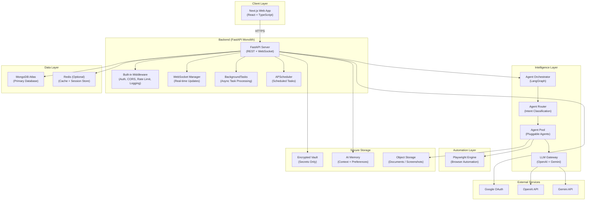

### Layer Responsibilities

| Layer | Responsibility | Key Technologies |
|---|---|---|
| **Client** | UI rendering, user interaction, state management | Next.js, React, TypeScript, Tailwind, shadcn/ui |
| **Backend** | Auth, CORS, rate limiting, business logic, REST API, WebSocket | FastAPI, BackgroundTasks, APScheduler |
| **Intelligence** | Agent orchestration, routing, LLM management | LangGraph, OpenAI, Gemini |
| **Automation** | Browser control, form filling, screenshot capture | Playwright |
| **Data** | Persistence, caching | MongoDB Atlas, Redis (optional) |
| **Secure Storage** | Vault for secrets, Memory for context, Object storage for files | MongoDB CSFLE, GridFS |

> [!IMPORTANT]
> Version 1 has **no API Gateway, no Celery, no browser pooling, no proxy rotation**. The FastAPI backend handles everything directly. This keeps the architecture simple, debuggable, and production-ready without premature distributed-system complexity.

---

## 2. Backend Architecture

The backend follows a **layered hexagonal architecture** (Ports & Adapters) to ensure testability and clean dependency management.

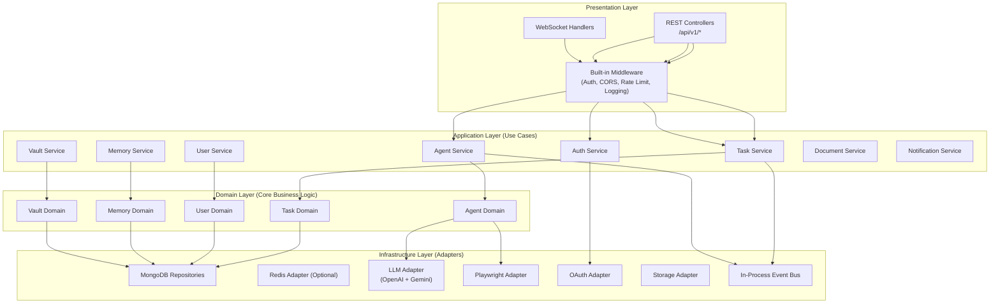

### Backend Folder Structure (Version 1)

```
backend/
├── app/
│   ├── api/                        # Presentation Layer
│   │   ├── v1/
│   │   │   ├── auth.py             # Auth endpoints
│   │   │   ├── users.py            # User endpoints
│   │   │   ├── tasks.py            # Task endpoints
│   │   │   ├── documents.py        # Document endpoints
│   │   │   ├── memory.py           # Memory endpoints
│   │   │   ├── vault.py            # Vault endpoints
│   │   │   ├── agents.py           # Agent endpoints
│   │   │   └── notifications.py    # Notification endpoints
│   │   ├── schemas/                # Pydantic request/response models
│   │   │   ├── auth.py
│   │   │   ├── user.py
│   │   │   ├── task.py
│   │   │   ├── document.py
│   │   │   ├── memory.py
│   │   │   ├── vault.py
│   │   │   └── agent.py
│   │   ├── websocket/              # WebSocket handlers
│   │   │   ├── task_ws.py
│   │   │   └── notification_ws.py
│   │   └── dependencies.py         # Dependency injection
│   │
│   ├── core/                       # Cross-cutting concerns
│   │   ├── config.py               # Settings (Pydantic BaseSettings)
│   │   ├── security.py             # JWT, hashing, encryption
│   │   ├── logging.py              # Structured logging
│   │   └── exceptions.py           # Custom exception hierarchy
│   │
│   ├── database/                   # Database Layer
│   │   ├── connection.py           # MongoDB connection manager
│   │   ├── indexes.py              # Index definitions
│   │   └── migrations.py           # Schema migrations
│   │
│   ├── repositories/               # Data Access Layer
│   │   ├── user_repo.py
│   │   ├── task_repo.py
│   │   ├── memory_repo.py
│   │   ├── vault_repo.py
│   │   ├── document_repo.py
│   │   └── agent_repo.py
│   │
│   ├── services/                   # Application Layer (Use Cases)
│   │   ├── auth_service.py
│   │   ├── user_service.py
│   │   ├── task_service.py
│   │   ├── memory_service.py
│   │   ├── vault_service.py
│   │   ├── document_service.py
│   │   ├── notification_service.py
│   │   └── scheduler_service.py    # APScheduler management
│   │
│   ├── agents/                     # Intelligence Layer
│   │   ├── orchestrator.py         # LangGraph orchestrator
│   │   ├── router.py               # Intent-based agent router
│   │   ├── registry.py             # Agent plugin registry
│   │   ├── base_agent.py           # Abstract base class
│   │   └── plugins/                # Individual agent plugins
│   │       ├── planner/
│   │       │   ├── agent.py
│   │       │   └── agent.manifest.json
│   │       ├── browser_agent/
│   │       │   ├── agent.py
│   │       │   └── agent.manifest.json
│   │       ├── form_filler/
│   │       │   ├── agent.py
│   │       │   └── agent.manifest.json
│   │       ├── execution_validator/
│   │       │   ├── agent.py
│   │       │   └── agent.manifest.json
│   │       └── __template__/       # Template for new agents
│   │           ├── agent.py
│   │           └── agent.manifest.json
│   │
│   ├── browser/                    # Browser Automation
│   │   ├── engine.py               # Playwright lifecycle manager
│   │   ├── actions.py              # Reusable browser actions
│   │   └── safety.py               # Domain allowlist, audit log
│   │
│   ├── memory/                     # AI Memory Module
│   │   ├── memory_manager.py       # Store, recall, forget
│   │   ├── categories.py           # Memory category definitions
│   │   └── vector_search.py        # Semantic search (future)
│   │
│   ├── vault/                      # Secure Vault Module
│   │   ├── vault_manager.py        # Encrypt, decrypt, store
│   │   ├── encryption.py           # AES-256-GCM encryption
│   │   └── key_management.py       # Per-user key management
│   │
│   ├── utils/                      # Shared Utilities
│   │   ├── event_bus.py            # In-process event bus
│   │   ├── helpers.py              # Common helpers
│   │   └── validators.py           # Custom validators
│   │
│   ├── middleware/                  # Custom Middleware
│   │   ├── auth_middleware.py      # JWT validation
│   │   ├── rate_limiter.py         # Rate limiting
│   │   ├── request_logger.py       # Structured request logging
│   │   └── error_handler.py        # Global error handler
│   │
│   └── main.py                     # FastAPI app factory
│
├── tests/
│   ├── unit/
│   ├── integration/
│   └── conftest.py
│
├── docker/
│   ├── Dockerfile
│   └── docker-compose.yml
│
├── docs/
│   └── api/                        # API documentation
│
├── pyproject.toml
├── .env.example
└── README.md
```

### Middleware Pipeline

All middleware is built into the FastAPI application — no external API gateway required.


### Task Processing (Version 1)

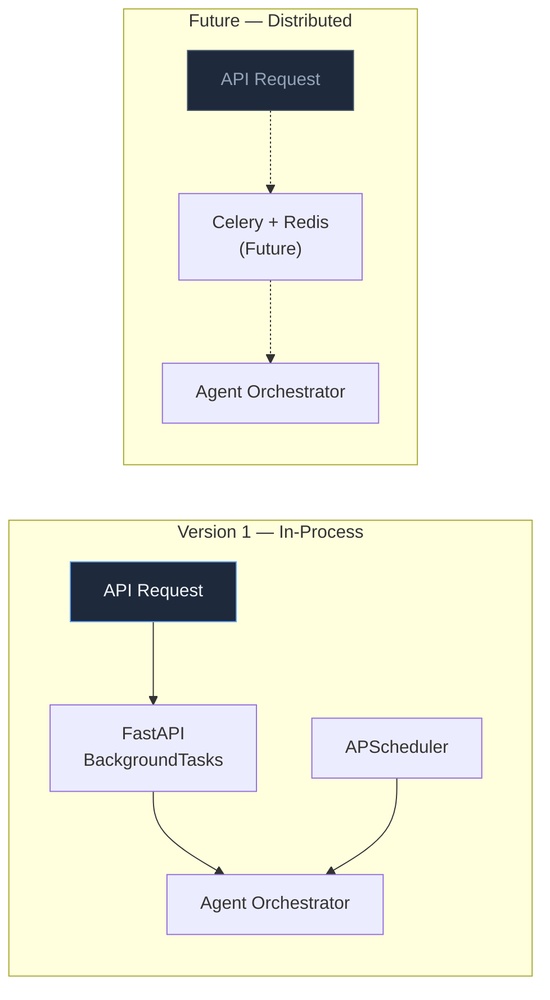

> [!TIP]
> Version 1 uses `FastAPI BackgroundTasks` for async task processing and `APScheduler` for scheduled tasks. Celery is reserved as a future scalability option when concurrent task volume exceeds what in-process async can handle.

---

## 3. Frontend Architecture

The frontend uses **Next.js App Router** with a feature-based module structure, ensuring scalability and maintainability.

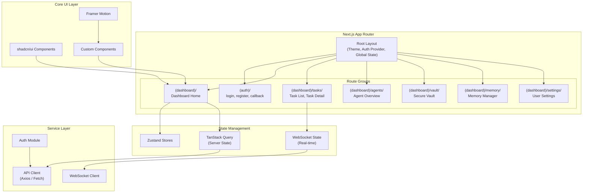

### Frontend Module Structure

```
frontend/
├── src/
│   ├── app/                        # Next.js App Router
│   │   ├── (auth)/
│   │   │   ├── login/page.tsx
│   │   │   ├── register/page.tsx
│   │   │   └── callback/page.tsx
│   │   ├── (dashboard)/
│   │   │   ├── layout.tsx          # Dashboard shell
│   │   │   ├── page.tsx            # Dashboard home
│   │   │   ├── tasks/
│   │   │   │   ├── page.tsx        # Task list
│   │   │   │   └── [id]/page.tsx   # Task detail (live view)
│   │   │   ├── agents/page.tsx
│   │   │   ├── vault/page.tsx
│   │   │   ├── memory/page.tsx
│   │   │   └── settings/page.tsx
│   │   ├── layout.tsx              # Root layout
│   │   └── page.tsx                # Landing page
│   │
│   ├── components/
│   │   ├── ui/                     # shadcn/ui primitives
│   │   ├── shared/                 # Shared custom components
│   │   ├── dashboard/              # Dashboard-specific
│   │   ├── tasks/                  # Task-related
│   │   └── agents/                 # Agent-related
│   │
│   ├── stores/                     # Zustand state stores
│   │   ├── auth-store.ts
│   │   ├── task-store.ts
│   │   └── ui-store.ts
│   │
│   ├── services/                   # API + WebSocket clients
│   │   ├── api-client.ts
│   │   ├── ws-client.ts
│   │   └── auth-service.ts
│   │
│   ├── hooks/                      # Custom React hooks
│   ├── lib/                        # Utilities
│   ├── types/                      # TypeScript type definitions
│   └── styles/                     # Global styles + Tailwind config
│
├── public/
├── next.config.ts
├── tailwind.config.ts
└── tsconfig.json
```

### Component Architecture

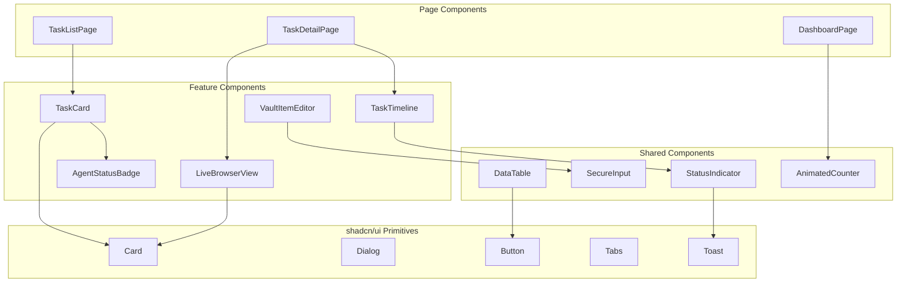

---

## 4. MongoDB Architecture

### Database Design Philosophy

- **Document-oriented modeling** — embed where access patterns demand it, reference where data is shared
- **Strict Memory / Vault separation** — secrets NEVER touch the Memory collection
- **Per-user encryption** for Vault fields via field-level encryption (MongoDB CSFLE)
- **TTL indexes** for ephemeral data (sessions, temp files)

### Memory vs Vault — Clear Separation

| | AI Memory | Secure Vault |
|---|---|---|
| **Purpose** | Context for agents to be smarter | Encrypted storage for secrets |
| **Stores** | Preferences, profile, context, task history, learned patterns | Passwords, credentials, API keys, OTPs, tokens |
| **Encryption** | Optional (only for PII like phone/address) | Always encrypted (AES-256-GCM, per-user keys) |
| **Access** | Agents read freely for task context | Agents request specific items with audit trail |
| **User Control** | View, edit, delete | View (masked), edit, delete, export |
| **Retention** | Decays over time, user-deletable | Permanent until user deletes |

> [!CAUTION]
> The Memory module must **NEVER** store passwords, login credentials, API keys, OTPs, or tokens. These belong exclusively in the Vault. This separation is enforced at the service layer with category validation.

### Collection Schema Design

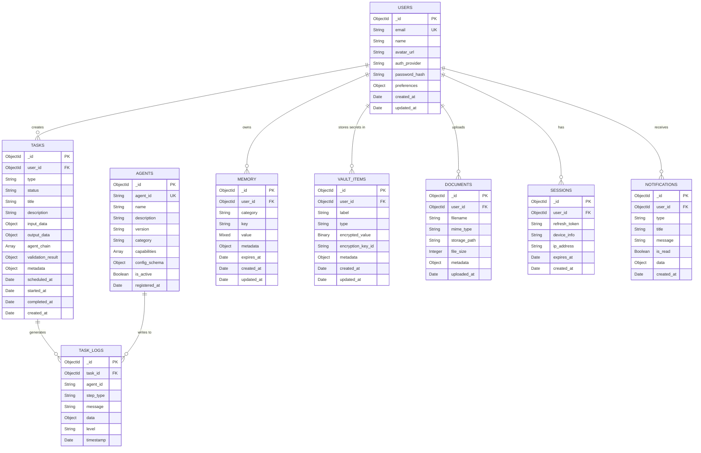

### Memory Categories (Allowed)

| Category | Examples | Encrypted |
|---|---|---|
| `profile` | Name, location, job title | Optional |
| `preferences` | Dark mode, notification settings, language | No |
| `task_history` | Past task results, success rates | No |
| `learned_patterns` | "User prefers morning appointments" | No |
| `context` | Current job search, active applications | No |

### Vault Item Types (Secrets Only)

| Type | Examples | Encrypted |
|---|---|---|
| `credential` | Website login, email password | ✅ Always |
| `api_key` | OpenAI key, service tokens | ✅ Always |
| `document` | Resume, cover letter, ID scan | ✅ Always |
| `payment` | Card details (if applicable) | ✅ Always |
| `token` | OAuth tokens, refresh tokens | ✅ Always |

### Indexing Strategy

| Collection | Index | Type | Purpose |
|---|---|---|---|
| `users` | `{ email: 1 }` | Unique | Login lookup |
| `tasks` | `{ user_id: 1, status: 1, created_at: -1 }` | Compound | Dashboard queries |
| `tasks` | `{ scheduled_at: 1 }` | Single | Scheduler polling |
| `task_logs` | `{ task_id: 1, timestamp: 1 }` | Compound | Log streaming |
| `memory` | `{ user_id: 1, category: 1, key: 1 }` | Compound + Unique | Memory lookup |
| `memory` | `{ expires_at: 1 }` | TTL | Auto-cleanup |
| `sessions` | `{ expires_at: 1 }` | TTL | Session cleanup |
| `vault_items` | `{ user_id: 1, type: 1 }` | Compound | Vault access |
| `documents` | `{ user_id: 1, uploaded_at: -1 }` | Compound | Document listing |
| `notifications` | `{ user_id: 1, is_read: 1, created_at: -1 }` | Compound | Notification feed |

### Field-Level Encryption (CSFLE) — Vault Only

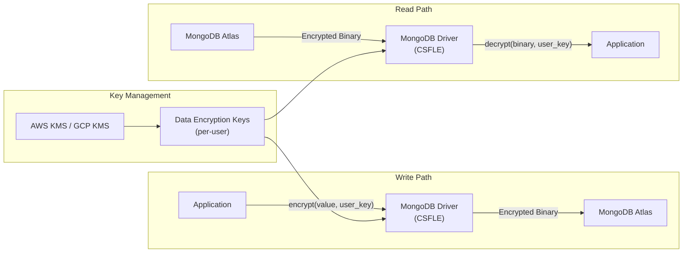

> [!IMPORTANT]
> Field-level encryption applies **only to Vault items**. Memory stores non-sensitive context data and does not require CSFLE. Master keys are stored in a cloud KMS, never in the application.

---

## 5. Agent Architecture

This is the **heart of NOVA**. The agent system is designed as a **plugin architecture** — any developer can add new agents without touching core code.

### Version 1 Agents

| Agent | Role | Phase |
|---|---|---|
| **Planner Agent** | Decomposes user requests into executable steps | Phase 1 |
| **Browser Agent** | Navigates websites, interacts with pages | Phase 1 |
| **Form Filler Agent** | Detects and fills web forms using Vault/Memory data | Phase 1 |
| **Execution Validator Agent** | Verifies task outcomes, confirms success or triggers retry | Phase 1 |
| **Calendar Agent** | Manages scheduling, books appointments | Phase 2 |
| **Job Agent** | Searches and applies to job postings | Phase 2 |
| **Document Agent** | Manages uploads, parsing, formatting | Phase 2 |
| **Email Agent** | Reads and composes emails | Future |
| **Research Agent** | Web research and data extraction | Future |

### Agent Plugin System

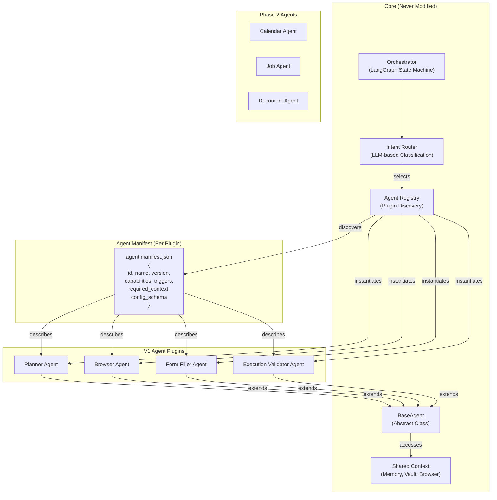

### Execution Validator Agent

The Execution Validator is a **core V1 agent** that runs after every browser action or task step to verify outcomes.

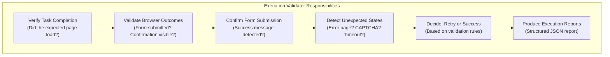

#### Validation Report Schema

```json
{
  "task_id": "task_abc123",
  "agent_id": "execution_validator",
  "timestamp": "2026-07-03T18:00:00Z",
  "validation": {
    "status": "success | failure | partial | needs_retry",
    "confidence": 0.95,
    "checks": [
      {
        "check": "page_title_match",
        "expected": "Application Submitted",
        "actual": "Application Submitted - Company X",
        "passed": true
      },
      {
        "check": "confirmation_element",
        "selector": ".confirmation-message",
        "found": true,
        "text": "Your application has been received",
        "passed": true
      }
    ],
    "screenshot_url": "https://storage/screenshots/task_abc123_validation.png",
    "retry_recommended": false,
    "failure_reason": null
  }
}
```

### Agent Manifest Schema

```json
{
  "id": "form_filler",
  "name": "Form Filler Agent",
  "version": "1.0.0",
  "description": "Autonomously fills web forms using user vault data",
  "category": "automation",
  "capabilities": [
    "form_detection",
    "field_mapping",
    "auto_fill",
    "submit_verification"
  ],
  "triggers": [
    "fill form",
    "complete application",
    "submit form"
  ],
  "required_context": ["vault", "browser", "memory"],
  "config_schema": {
    "auto_submit": { "type": "boolean", "default": false },
    "screenshot_on_submit": { "type": "boolean", "default": true }
  },
  "llm_preference": "gpt-5.5",
  "max_retries": 3,
  "timeout_seconds": 300
}
```

### BaseAgent Contract

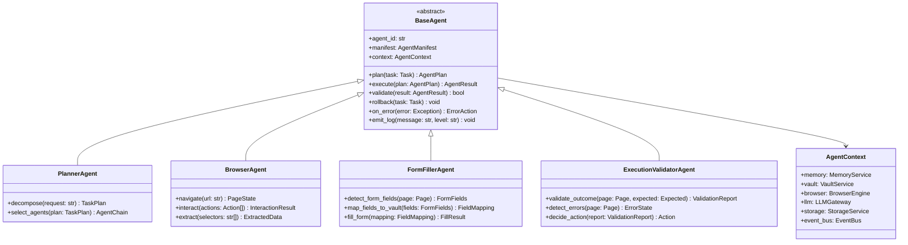

### LangGraph Orchestration Flow (Version 1)

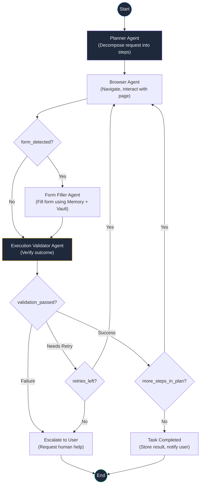

### Adding a New Agent (Zero Core Changes)

```
1. Create folder:  agents/plugins/my_new_agent/
2. Add manifest:   agents/plugins/my_new_agent/agent.manifest.json
3. Add agent:      agents/plugins/my_new_agent/agent.py  (extends BaseAgent)
4. (Optional):     agents/plugins/my_new_agent/tools.py   (custom tools)
5. Registry auto-discovers on startup — DONE.
```

> [!TIP]
> The `__template__/` directory inside `agents/plugins/` provides a scaffolding template. Run `python -m agents.scaffold my_new_agent` to auto-generate the boilerplate.

---

## 6. API Architecture

### API Design Principles

- **RESTful** with consistent resource naming
- **Versioned** (`/api/v1/`) for backward compatibility
- **Paginated** with cursor-based pagination for large datasets
- **Rate-limited** per user tier (free: 100 req/min, pro: 1000 req/min)
- **WebSocket** for real-time task progress streaming

### Version 1 API Endpoint Map

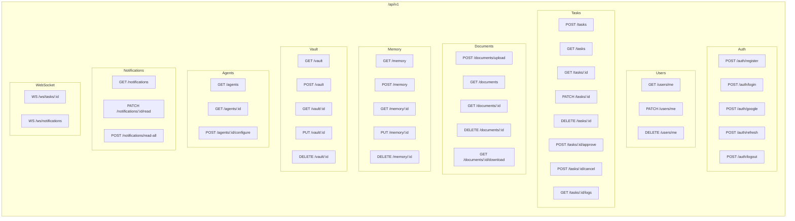

### APIs Deferred to Future Phases

| API Group | Phase | Reason |
|---|---|---|
| Workflow APIs (`/workflows/*`) | Phase 3 | Workflow builder is a Phase 3 feature |
| Marketplace APIs (`/marketplace/*`) | Phase 3 | Agent marketplace is a Phase 3 feature |
| Plugin APIs (`/plugins/*`) | Phase 3 | Plugin system is a Phase 3 feature |
| Analytics APIs (`/analytics/*`) | Phase 3 | Analytics platform is a Phase 3 feature |

### Standard Response Envelope

```json
{
  "success": true,
  "data": { "...payload..." },
  "meta": {
    "page": 1,
    "per_page": 20,
    "total": 150,
    "next_cursor": "abc123"
  },
  "error": null,
  "request_id": "req_8f3a2b1c"
}
```

### Error Response

```json
{
  "success": false,
  "data": null,
  "error": {
    "code": "TASK_NOT_FOUND",
    "message": "Task with id 'xyz' was not found",
    "details": {},
    "help_url": "https://docs.nova.ai/errors/TASK_NOT_FOUND"
  },
  "request_id": "req_8f3a2b1c"
}
```

### WebSocket Protocol

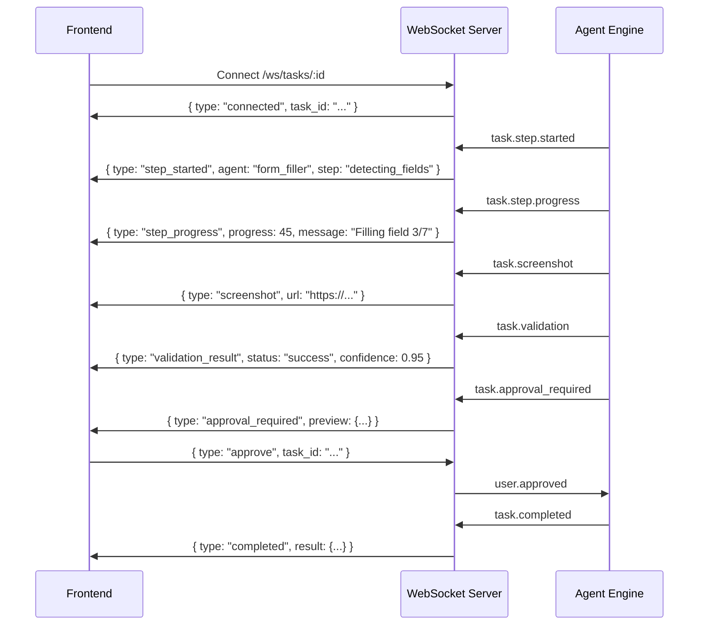

---

## 7. Authentication Flow

### JWT + Google OAuth Architecture

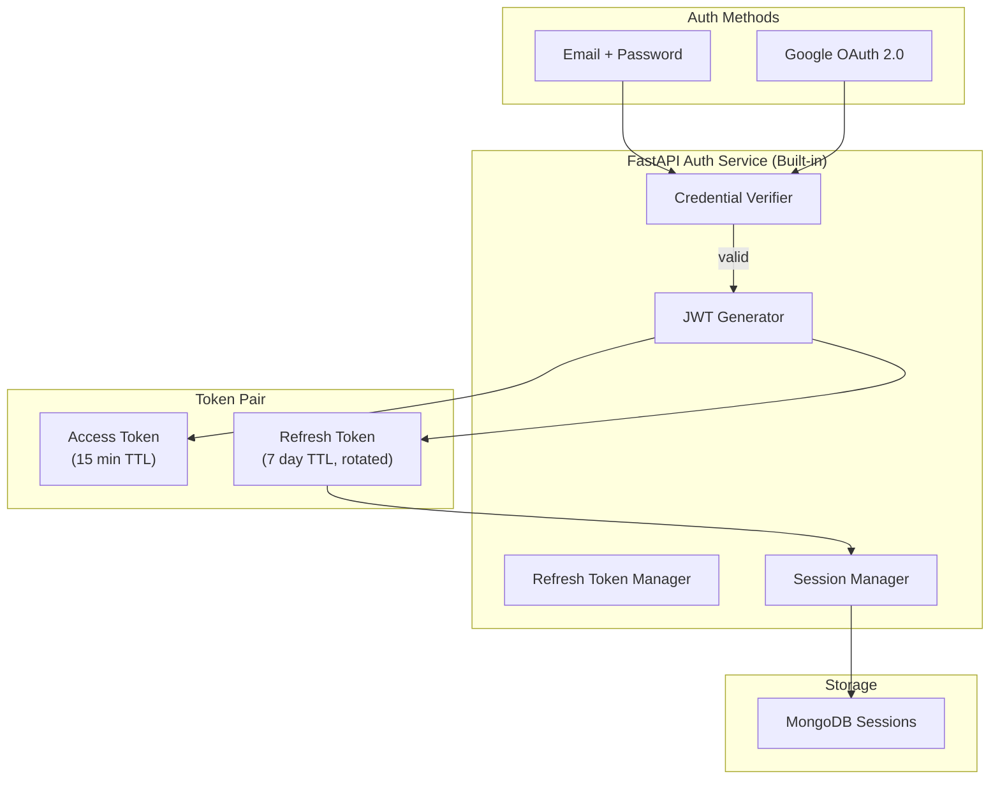

### Google OAuth Flow

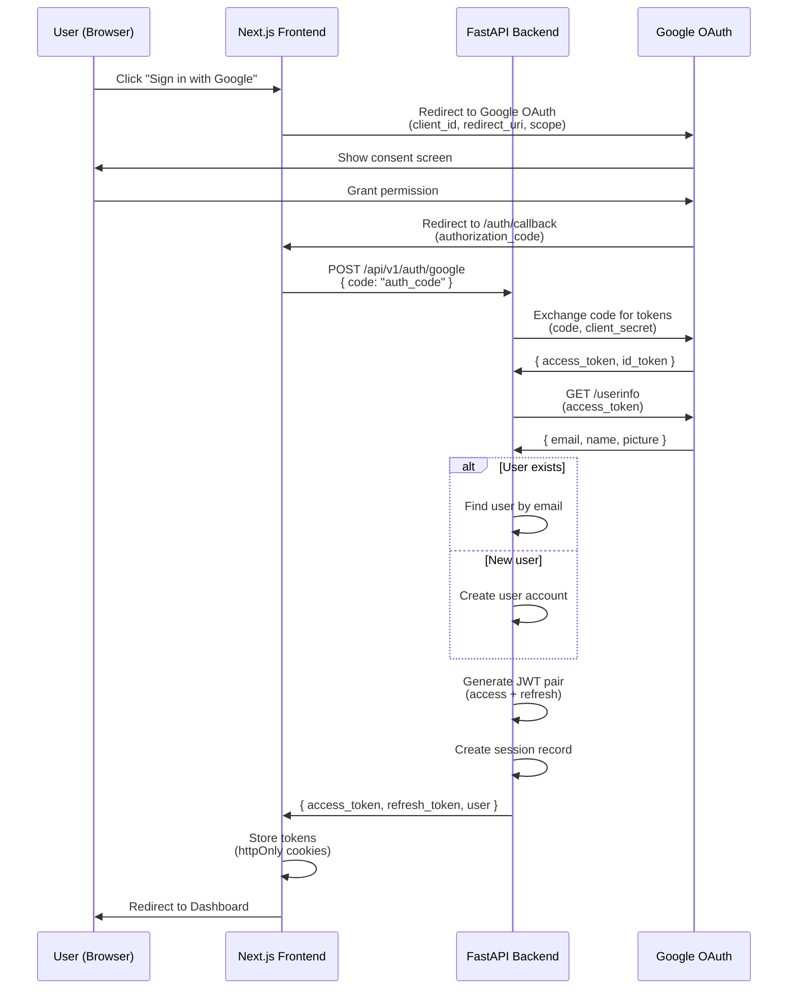

### Token Refresh Flow

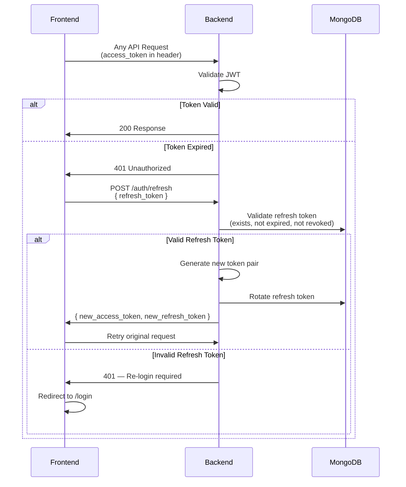

### JWT Payload Structure

```json
{
  "sub": "user_64a1b2c3d4e5f6",
  "email": "user@example.com",
  "name": "Alex Johnson",
  "role": "pro",
  "permissions": ["tasks:*", "vault:read", "agents:execute"],
  "iat": 1720000000,
  "exp": 1720000900,
  "jti": "tok_unique_id",
  "iss": "nova.ai"
}
```

---

## 8. Browser Automation Flow

### Playwright Engine Architecture (Version 1)

Version 1 uses a **simple lifecycle model** — one fresh browser context per task, closed immediately after completion. No pooling, no proxy rotation.

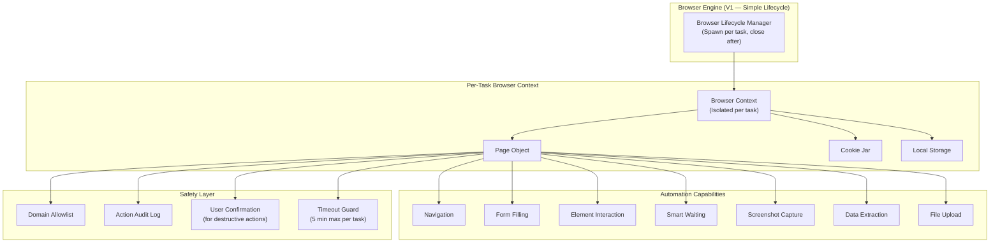

### Browser Task Lifecycle (Version 1)

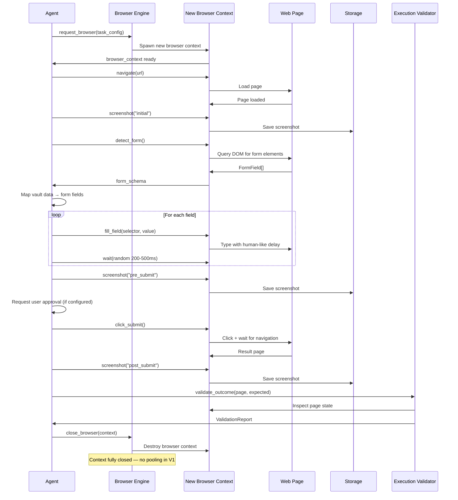

### Browser Security Model

| Layer | Protection | Description |
|---|---|---|
| **Domain Allowlist** | URL filtering | Only navigate to user-approved domains |
| **Action Audit Log** | Full logging | Every browser action is logged with timestamps |
| **Confirmation Gates** | User approval | Destructive actions (submit, purchase) require confirmation |
| **Timeout Guard** | 5-min max per task | Prevents runaway browser sessions |
| **Resource Limits** | 512MB memory limit | Prevents memory leaks |

### Future Browser Optimizations

| Feature | Phase | Description |
|---|---|---|
| Browser Pool Manager | Phase 3 | Reuse browser instances across tasks |
| Proxy Rotation | Phase 3 | Rotate IPs for anti-detection |
| Fingerprint Randomization | Phase 3 | Randomize browser fingerprints |
| User Agent Rotation | Phase 3 | Rotate user agents |
| Remote Browser Farm | Phase 3 | Browserless.io integration for scale |

---

## 9. Memory Flow

NOVA's memory system gives agents **persistent, contextual knowledge** about each user — making the system smarter over time. Memory is strictly separated from the Vault.

### Memory vs Vault Data Flow

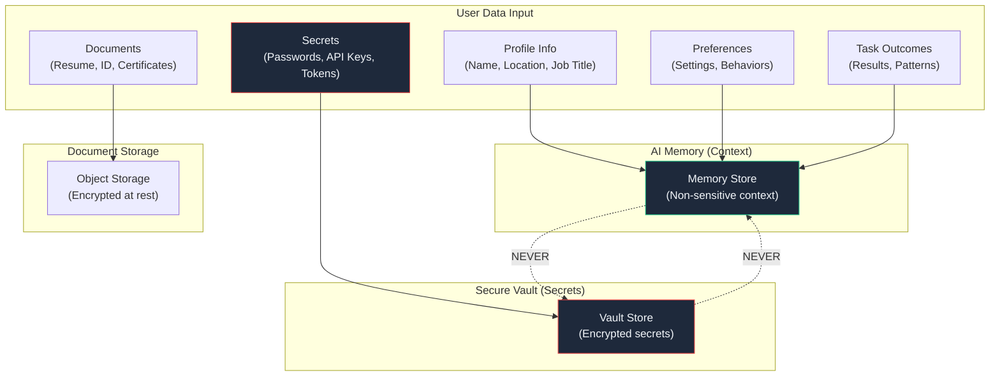

### Memory Architecture

```mermaid
graph TB
    subgraph "Memory Types"
        EPISODIC["Episodic Memory<br/>(What happened — task history)"]
        SEMANTIC["Semantic Memory<br/>(What I know — user facts)"]
        PROCEDURAL["Procedural Memory<br/>(How to do — learned workflows)"]
    end

    subgraph "Memory Operations"
        STORE["Store<br/>(Write new memory)"]
        RECALL["Recall<br/>(Query relevant memories)"]
        FORGET["Forget<br/>(User-initiated deletion)"]
        DECAY["Decay<br/>(Auto-expire stale memories)"]
    end

    subgraph "Storage Backend"
        MONGO_MEM["MongoDB<br/>(Structured memories)"]
    end

    subgraph "Access Control"
        PER_USER["Per-User Isolation"]
        CATEGORY_CHECK["Category Validation<br/>(Block secrets from Memory)"]
    end

    EPISODIC --> STORE
    SEMANTIC --> STORE
    PROCEDURAL --> STORE

    STORE --> CATEGORY_CHECK
    CATEGORY_CHECK -->|"Allowed category"| MONGO_MEM
    CATEGORY_CHECK -->|"Secret detected"| REJECT["❌ Rejected<br/>(Redirect to Vault)"]

    RECALL --> MONGO_MEM
    FORGET --> MONGO_MEM
    DECAY --> MONGO_MEM

    PER_USER --> MONGO_MEM
```

### Memory Recall Flow

```mermaid
sequenceDiagram
    participant Agent as Agent
    participant MemSvc as Memory Service
    participant DB as MongoDB

    Agent->>MemSvc: recall(user_id, query, context)

    MemSvc->>DB: Query by user_id + category + key
    DB->>MemSvc: memory_documents

    MemSvc->>MemSvc: Rank by relevance + recency
    MemSvc->>MemSvc: Filter by category permissions
    MemSvc->>Agent: MemoryContext[]
```

### Memory Lifecycle

```mermaid
graph LR
    CREATE["Memory Created<br/>(by Agent or User)"] --> ACTIVE["Active<br/>(In use)"]
    ACTIVE -->|"Accessed frequently"| REINFORCED["Reinforced<br/>(Higher relevance score)"]
    ACTIVE -->|"Not accessed"| DECAYED["Decayed<br/>(Lower relevance score)"]
    REINFORCED --> ACTIVE
    DECAYED -->|"Below threshold"| ARCHIVED["Archived"]
    ARCHIVED -->|"Recalled"| ACTIVE
    ARCHIVED -->|"TTL expired"| DELETED["Deleted"]
    ACTIVE -->|"User requests"| DELETED
    DECAYED -->|"User requests"| DELETED

    style CREATE fill:#1e293b,stroke:#60a5fa,color:#f1f5f9
    style ACTIVE fill:#1e293b,stroke:#10b981,color:#f1f5f9
    style DELETED fill:#1e293b,stroke:#ef4444,color:#f1f5f9
```

### Future Memory Enhancements

| Feature | Phase | Description |
|---|---|---|
| Redis Hot Cache | Phase 2 | Cache frequently accessed memories |
| Atlas Vector Search | Phase 2 | Semantic similarity search for context recall |
| Memory Consolidation | Phase 3 | Merge similar memories automatically |

---

## 10. Task Execution Flow

### Task Lifecycle State Machine

```mermaid
stateDiagram-v2
    [*] --> CREATED: User submits task

    CREATED --> QUEUED: Validated + Enqueued
    CREATED --> REJECTED: Validation failed

    QUEUED --> PLANNING: Planner Agent assigned
    PLANNING --> AWAITING_APPROVAL: Plan requires approval
    PLANNING --> EXECUTING: Auto-approved

    AWAITING_APPROVAL --> EXECUTING: User approves
    AWAITING_APPROVAL --> CANCELLED: User rejects

    EXECUTING --> VALIDATING: Step completed
    VALIDATING --> EXECUTING: Validator passes, next step
    VALIDATING --> FAILED: Validator detects failure
    EXECUTING --> PAUSED: Agent needs input

    PAUSED --> EXECUTING: User provides input
    PAUSED --> CANCELLED: User cancels

    FAILED --> RETRYING: Auto-retry (if retries left)
    RETRYING --> EXECUTING: Retry attempt
    RETRYING --> ESCALATED: Max retries exceeded

    ESCALATED --> EXECUTING: User provides fix
    ESCALATED --> CANCELLED: User gives up

    VALIDATING --> COMPLETED: All steps validated

    COMPLETED --> [*]
    CANCELLED --> [*]
    REJECTED --> [*]
```

### End-to-End Task Execution (with Execution Validator)

```mermaid
sequenceDiagram
    participant User as User
    participant FE as Frontend
    participant API as FastAPI
    participant BG as BackgroundTasks
    participant Planner as Planner Agent
    participant Browser as Browser Agent
    participant Filler as Form Filler Agent
    participant Validator as Execution Validator
    participant LLM as LLM Gateway
    participant Memory as Memory Service
    participant Vault as Vault Service
    participant DB as MongoDB
    participant WS as WebSocket

    User->>FE: "Apply to this job posting"
    FE->>API: POST /api/v1/tasks<br/>{ type: "job_application", input: { url: "..." } }
    API->>API: Validate + Create task
    API->>DB: Save task (status: CREATED)
    API->>BG: Enqueue via BackgroundTasks
    API->>FE: { task_id: "...", status: "QUEUED" }

    FE->>WS: Connect /ws/tasks/:task_id

    BG->>Planner: plan(task)
    Planner->>LLM: Decompose into steps
    LLM->>Planner: [navigate, detect_form, fill_form, submit, validate]
    Planner->>WS: { type: "planning", steps: [...] }

    Planner->>DB: Update status: EXECUTING
    Planner->>Browser: execute step 1: navigate(job_url)
    Browser->>WS: { type: "step_progress", step: "navigating" }

    Browser->>Browser: detect_form()
    Browser->>Filler: form_schema + page

    Filler->>Memory: recall(user_id, "profile, work history")
    Memory->>Filler: user_context
    Filler->>Vault: get_items(user_id, type: "credential")
    Vault->>Filler: decrypted_credentials
    Filler->>Browser: fill_form(mapped_data)
    Filler->>WS: { type: "step_progress", step: "filling_form" }

    Filler->>Browser: screenshot("pre_submit")
    Filler->>WS: { type: "screenshot", url: "..." }

    Browser->>Browser: click_submit()
    Browser->>Browser: screenshot("post_submit")

    Browser->>Validator: validate_outcome(page, expected)
    Validator->>Browser: Inspect page state
    Validator->>Validator: Run validation checks
    Validator->>WS: { type: "validation_result", status: "success" }

    alt Validation Passed
        Validator->>Planner: ValidationReport(success)
        Planner->>Memory: store("applied to {company}", category: "task_history")
        Planner->>DB: Update status: COMPLETED
        Planner->>WS: { type: "completed", result: {...} }
    else Validation Failed
        Validator->>Planner: ValidationReport(needs_retry)
        Planner->>WS: { type: "retrying", reason: "..." }
        Planner->>Browser: retry step
    end

    WS->>FE: Show result + screenshots
```

---

## 11. Sequence Diagrams

### User Onboarding Flow

```mermaid
sequenceDiagram
    participant User as New User
    participant FE as Frontend
    participant API as Backend
    participant DB as MongoDB
    participant Vault as Vault Service
    participant Memory as Memory Service

    User->>FE: Visit nova.ai
    User->>FE: Click "Get Started"
    FE->>FE: Redirect to /register

    User->>FE: Click "Sign up with Google"
    Note over FE, API: [Google OAuth flow as described in Section 7]
    API->>FE: { user, tokens }

    FE->>FE: Redirect to /onboarding

    FE->>User: Step 1: "Tell us about yourself"
    User->>FE: Enter name, phone, location
    FE->>API: POST /memory (batch)
    API->>Memory: Store profile info
    Memory->>DB: Write to memory collection

    FE->>User: Step 2: "Upload your resume"
    User->>FE: Upload resume.pdf
    FE->>API: POST /documents/upload
    API->>DB: Store document metadata

    FE->>User: Step 3: "Add login credentials (optional)"
    User->>FE: Add website credentials
    FE->>API: POST /vault { type: "credential", ... }
    API->>Vault: Encrypt + store in vault

    FE->>User: Step 4: "What can NOVA help with?"
    User->>FE: Select: Jobs, Scheduling, Forms
    FE->>API: PATCH /users/me
    API->>DB: Save preferences

    FE->>User: Dashboard tour
    FE->>FE: Interactive walkthrough
    FE->>User: "You're all set!"
```

### Multi-Agent Coordination (with Execution Validator)

```mermaid
sequenceDiagram
    participant Planner as Planner Agent
    participant Browser as Browser Agent
    participant Filler as Form Filler Agent
    participant Validator as Execution Validator
    participant LLM as LLM Gateway
    participant Mem as Memory
    participant Vault as Vault

    Note over Planner: Task: "Fill out the DMV appointment form"

    Planner->>LLM: Decompose task
    LLM->>Planner: Steps: [navigate, fill_form, submit, validate]

    Planner->>Browser: navigate("dmv.gov/appointments")
    Browser->>Browser: Page loaded
    Browser->>Validator: validate(page loaded correctly?)
    Validator->>Planner: ✅ Page confirmed

    Browser->>Browser: detect_form()
    Browser->>Filler: form_schema

    Filler->>Mem: recall(user_id, "profile")
    Mem->>Filler: { name, dob, address, phone }
    Filler->>Vault: get_items(user_id, type: "document")
    Vault->>Filler: { dl_number: "D1234..." }

    Filler->>Browser: fill_form(mapped_data)
    Filler->>Validator: validate(all fields filled correctly?)
    Validator->>Planner: ✅ Form validated

    Browser->>Browser: submit_form()
    Browser->>Validator: validate(submission successful?)
    Validator->>Validator: Check for confirmation message
    Validator->>Validator: Produce execution report
    Validator->>Planner: ✅ ValidationReport(success, confidence: 0.97)

    Planner->>Mem: store("DMV appointment booked for July 15")
    Planner->>Planner: Task complete → notify user
```

### Error Recovery Flow

```mermaid
sequenceDiagram
    participant Planner as Planner Agent
    participant Browser as Browser Agent
    participant Validator as Execution Validator
    participant User as User (via WS)

    Planner->>Browser: navigate(url)
    Browser->>Browser: Page loaded

    Browser->>Browser: click("#apply-btn")
    Browser->>Validator: validate(button clicked?)
    Validator->>Validator: ❌ ElementNotFound

    Validator->>Planner: ValidationReport(needs_retry, reason: "Element not found")
    Planner->>Planner: Ask LLM for alternative selector
    Planner->>Browser: click("button:has-text('Apply')")
    Browser->>Validator: validate(button clicked?)
    Validator->>Planner: ✅ Clicked

    Browser->>Browser: fill_form(data)
    Browser->>Validator: validate(form filled?)
    Validator->>Validator: ❌ CaptchaDetected

    Validator->>Planner: ValidationReport(failure, reason: "CAPTCHA")
    Planner->>User: { type: "escalation", reason: "CAPTCHA", screenshot: "..." }
    User->>Planner: Provides CAPTCHA solution
    Planner->>Browser: solve_captcha(solution)
    Browser->>Validator: validate(captcha solved?)
    Validator->>Planner: ✅ CAPTCHA solved, continue
```

---

## 12. Data Flow Diagrams

### Overall Data Flow

```mermaid
graph TB
    subgraph "User Input"
        CMD["User Command<br/>(Natural language)"]
        FILE["Uploaded Files"]
        SECRET["Secrets / Credentials"]
    end

    subgraph "Processing Pipeline"
        PLANNER_DF["Planner Agent<br/>(Task Decomposition)"]
        BROWSER_DF["Browser Agent<br/>(Page Interaction)"]
        FILLER_DF["Form Filler Agent<br/>(Data Mapping)"]
        VALIDATOR_DF["Execution Validator<br/>(Outcome Verification)"]
    end

    subgraph "Data Stores"
        TASKS_DB["Tasks Collection"]
        LOGS_DB["Logs Collection"]
        MEM_DB["Memory Collection<br/>(Context only)"]
        VAULT_DB["Vault Collection<br/>(Secrets only)"]
        DOCS_DB["Document Storage"]
    end

    subgraph "Output"
        RESULT["Task Result"]
        NOTIFY["Notification"]
        SCREENSHOT["Screenshots"]
        REPORT["Validation Report"]
    end

    CMD --> PLANNER_DF --> BROWSER_DF --> FILLER_DF --> VALIDATOR_DF
    FILE --> DOCS_DB
    SECRET --> VAULT_DB

    PLANNER_DF --> TASKS_DB
    BROWSER_DF --> LOGS_DB
    FILLER_DF --> MEM_DB
    FILLER_DF --> VAULT_DB

    VALIDATOR_DF --> RESULT --> TASKS_DB
    VALIDATOR_DF --> REPORT --> LOGS_DB
    VALIDATOR_DF --> NOTIFY
    BROWSER_DF --> SCREENSHOT --> DOCS_DB
```

### Real-Time Data Flow (WebSocket)

```mermaid
graph LR
    subgraph "Backend Events"
        E1["task.created"]
        E2["task.step.started"]
        E3["task.step.progress"]
        E4["task.screenshot"]
        E5["task.validation_result"]
        E6["task.approval_required"]
        E7["task.completed"]
        E8["task.error"]
    end

    subgraph "In-Process Event Bus"
        BUS["Event Bus<br/>(Python asyncio)"]
    end

    subgraph "WebSocket Server"
        WSS["WS Connection Manager"]
        FILTER["User Subscription Filter"]
    end

    subgraph "Frontend Consumers"
        TASK_VIEW["TaskDetailPage<br/>(Live progress)"]
        DASH_WIDGET["Dashboard<br/>(Activity feed)"]
        TOAST["Toast Notifications"]
    end

    E1 --> BUS
    E2 --> BUS
    E3 --> BUS
    E4 --> BUS
    E5 --> BUS
    E6 --> BUS
    E7 --> BUS
    E8 --> BUS

    BUS --> WSS --> FILTER
    FILTER --> TASK_VIEW
    FILTER --> DASH_WIDGET
    FILTER --> TOAST
```

### Data Encryption Flow (Vault Only)

```mermaid
graph TB
    subgraph "Client Side"
        INPUT["Sensitive Input<br/>(e.g., password, API key)"]
        TLS["TLS 1.3 Encryption<br/>(in transit)"]
    end

    subgraph "Application Layer"
        CLASSIFY["Data Router<br/>(Memory or Vault?)"]
        ENCRYPT["Vault Encryption<br/>(AES-256-GCM)"]
    end

    subgraph "Key Management"
        MASTER["Master Key<br/>(Cloud KMS)"]
        DEK_GEN["DEK Generator<br/>(per-user key)"]
        DEK_STORE["Encrypted DEK Store"]
    end

    subgraph "Storage"
        VAULT_FINAL["Vault Collection<br/>(Encrypted secrets)"]
        MEM_FINAL["Memory Collection<br/>(Non-sensitive context)"]
    end

    INPUT -->|"HTTPS"| TLS --> CLASSIFY
    CLASSIFY -->|"Secret (password, key, token)"| ENCRYPT --> VAULT_FINAL
    CLASSIFY -->|"Context (preference, profile)"| MEM_FINAL

    MASTER --> DEK_GEN --> DEK_STORE
    DEK_STORE --> ENCRYPT
```

---

## 13. Implementation Phases

### Phase Overview

```mermaid
timeline
    title NOVA Implementation Roadmap

    section Phase 1 — Foundation
        Backend Foundation : FastAPI + MongoDB + Auth
        Authentication : JWT + Google OAuth
        Frontend : Next.js + Dashboard shell
        Planner Agent : Task decomposition
        Browser Agent : Playwright automation
        Form Filler Agent : Form detection + filling
        Execution Validator : Outcome verification

    section Phase 2 — Intelligence
        Memory Service : Context recall + store
        Document Service : Upload, parse, manage
        Notification System : Real-time + in-app
        Execution Validator : Advanced validation rules
        Calendar Agent : Appointment booking
        Job Agent : Job search + apply

    section Phase 3 — Scale
        Agent Marketplace : Third-party agents
        Workflow Builder : Custom automation flows
        Browser Pool : Reuse browser instances
        Redis Pub/Sub : Distributed events
        Multi-tenancy : Organization support
        Analytics Platform : Usage insights
```

### Phase 1 — Foundation

**Goal:** Working end-to-end system — user can submit a task, agents execute it, results are returned.

| Component | Deliverable |
|---|---|
| **Backend Foundation** | FastAPI server, MongoDB connection, middleware (CORS, auth, rate limit, logging) |
| **Authentication** | JWT (access + refresh tokens), Google OAuth, session management |
| **Frontend** | Next.js app, login/register, dashboard shell, task list, task detail (live view) |
| **Planner Agent** | Accepts user request, decomposes into steps, selects agents |
| **Browser Agent** | Playwright lifecycle (spawn → execute → close), navigation, form detection, screenshots |
| **Form Filler Agent** | Field detection, field-to-data mapping, auto-fill with human-like timing |
| **Execution Validator** | Page state validation, success/failure detection, structured reports, retry decisions |
| **Task Management** | Create, list, view, cancel tasks; real-time progress via WebSocket |

### Phase 2 — Intelligence

**Goal:** System becomes context-aware and handles more complex tasks.

| Component | Deliverable |
|---|---|
| **Memory Service** | Store/recall user context, category validation, relevance scoring, decay |
| **Vault Service** | Encrypted secret storage, per-user keys, audit trail |
| **Document Service** | Upload, store, parse (resume, ID), reference in tasks |
| **Notification System** | In-app notifications, WebSocket push, notification preferences |
| **Calendar Agent** | Detect available slots, book appointments, calendar integration |
| **Job Agent** | Search job postings, match resume, auto-apply |
| **Redis Cache** | Cache hot memory, session store, rate limiter backend |

### Phase 3 — Scale

**Goal:** Platform scales to many users and supports third-party agents.

| Component | Deliverable |
|---|---|
| **Agent Marketplace** | Discover, install, configure third-party agents |
| **Workflow Builder** | Visual workflow editor, multi-step automation, triggers |
| **Plugin Marketplace** | Community-contributed plugins and integrations |
| **Browser Pool** | Reuse browser instances, connection pooling, health checks |
| **Proxy Rotation** | IP rotation, fingerprint randomization, anti-detection |
| **Redis Pub/Sub** | Distributed event bus, cross-instance WebSocket |
| **Multi-tenancy** | Organization support, team workspaces, role-based access |
| **Analytics Platform** | Usage metrics, agent performance, task success rates |
| **Celery Workers** | Distributed task processing with Redis broker |

---

## 14. Future Scalability

### Scaling Strategy by Phase

```mermaid
graph TB
    subgraph "Phase 1 — Current"
        P1_API["Single FastAPI Instance<br/>(BackgroundTasks + APScheduler)"]
        P1_DB["MongoDB Atlas M10<br/>(Shared cluster)"]
        P1_DEPLOY["Vercel + Railway"]
    end

    subgraph "Phase 2 — Growth"
        P2_API["Multiple Uvicorn Workers"]
        P2_REDIS["Redis<br/>(Cache + Rate Limiter)"]
        P2_DB["MongoDB Atlas M30<br/>(Dedicated cluster)"]
    end

    subgraph "Phase 3 — Scale"
        P3_API["Celery + Redis Broker<br/>(Distributed tasks)"]
        P3_POOL["Browser Pool<br/>(Playwright farm)"]
        P3_PUBSUB["Redis Pub/Sub<br/>(Distributed events)"]
        P3_DB["MongoDB Sharding"]
    end

    subgraph "Future — Enterprise"
        F_K8S["Kubernetes"]
        F_MULTI["Multi-Region"]
        F_KAFKA["Kafka Event Streaming"]
        F_MESH["Service Mesh"]
    end

    P1_API -->|"1K users"| P2_API
    P1_DB -->|"Growth"| P2_DB
    P2_API -->|"10K users"| P3_API
    P2_DB -->|"Scale"| P3_DB
    P3_API -->|"100K+ users"| F_K8S
```

### Service Decomposition Plan

When NOVA outgrows the modular monolith, each module can be extracted independently:

```mermaid
graph TB
    subgraph "Current: Modular Monolith"
        MONO["Single FastAPI App<br/>(All modules with clean boundaries)"]
    end

    subgraph "Future: Microservices (Phase 3+)"
        AUTH_MS["Auth Service"]
        TASK_MS["Task Service"]
        AGENT_MS["Agent Service"]
        BROWSER_MS["Browser Service"]
        MEMORY_MS["Memory Service"]
        VAULT_MS["Vault Service"]
    end

    MONO -.->|"Extract when needed"| AUTH_MS
    MONO -.->|"Extract when needed"| TASK_MS
    MONO -.->|"Extract when needed"| AGENT_MS
    MONO -.->|"Extract when needed"| BROWSER_MS
    MONO -.->|"Extract when needed"| MEMORY_MS
    MONO -.->|"Extract when needed"| VAULT_MS
```

### Key Scalability Decisions

| Concern | V1 Approach | Future Approach | Trigger |
|---|---|---|---|
| **Task Processing** | FastAPI BackgroundTasks | Celery + Redis broker | > 100 concurrent tasks |
| **Browser Sessions** | Spawn per task, close after | Browser pool + Browserless.io | > 20 concurrent browsers |
| **Database** | MongoDB Atlas M10 | Sharded cluster + read replicas | > 50GB data |
| **LLM Calls** | Direct API calls | Queue + rate limiter + fallback | > 1000 calls/min |
| **File Storage** | MongoDB GridFS | S3/GCS + CDN | > 10GB files |
| **Real-time Events** | In-process event bus | Redis Pub/Sub | > 5000 concurrent connections |
| **Caching** | In-memory (dict) | Redis cluster | > 1000 active users |
| **Rate Limiting** | In-memory | Redis-backed | Multiple server instances |

### Disaster Recovery & High Availability (Future)

```mermaid
graph TB
    subgraph "Primary Region"
        API_P["API Servers (Active)"]
        MONGO_P["MongoDB Primary"]
    end

    subgraph "Secondary Region"
        API_S["API Servers (Standby)"]
        MONGO_S["MongoDB Secondary<br/>(Auto-failover)"]
    end

    subgraph "Global"
        DNS["DNS Failover<br/>(Cloudflare)"]
        BACKUP["Automated Backups<br/>(Daily, 30-day retention)"]
        MONITOR["Monitoring<br/>(Datadog / Grafana)"]
    end

    API_P <-->|"Replication"| API_S
    MONGO_P <-->|"Replica Set"| MONGO_S

    DNS --> API_P
    DNS -.->|"Failover"| API_S
    MONGO_P --> BACKUP
    MONITOR --> API_P
    MONITOR --> MONGO_P
```

---

## Architecture Summary

| Aspect | V1 Decision | Rationale |
|---|---|---|
| **Overall Pattern** | Production-grade Modular Monolith | Simple, debuggable, extractable later |
| **Backend Pattern** | Hexagonal Architecture (Ports & Adapters) | Clean boundaries, testable |
| **Task Processing** | FastAPI BackgroundTasks + APScheduler | No Celery overhead in V1 |
| **Agent System** | Plugin Architecture + LangGraph | Infinite extensibility |
| **Core V1 Agents** | Planner + Browser + Form Filler + Execution Validator | Minimum viable agent chain |
| **Database** | MongoDB Atlas | Flexible schema, good Python support |
| **Memory vs Vault** | Strict separation — secrets NEVER in Memory | Security by design |
| **Real-time** | WebSocket + In-process event bus | Simple, no Redis Pub/Sub needed in V1 |
| **Auth** | JWT + Google OAuth + Refresh Rotation | Stateless + secure |
| **Browser** | Playwright — spawn per task, close after | Simple lifecycle, no pooling in V1 |
| **API Surface** | Auth, Users, Tasks, Documents, Memory, Vault, Agents, Notifications | Lean V1 scope |

> [!IMPORTANT]
> This architecture is designed so that **adding a new agent requires ZERO changes to core code**. Simply drop a new plugin folder with a manifest and agent class, and the registry auto-discovers it on startup. The modular monolith structure ensures any module can be extracted into a microservice when scale demands it.
